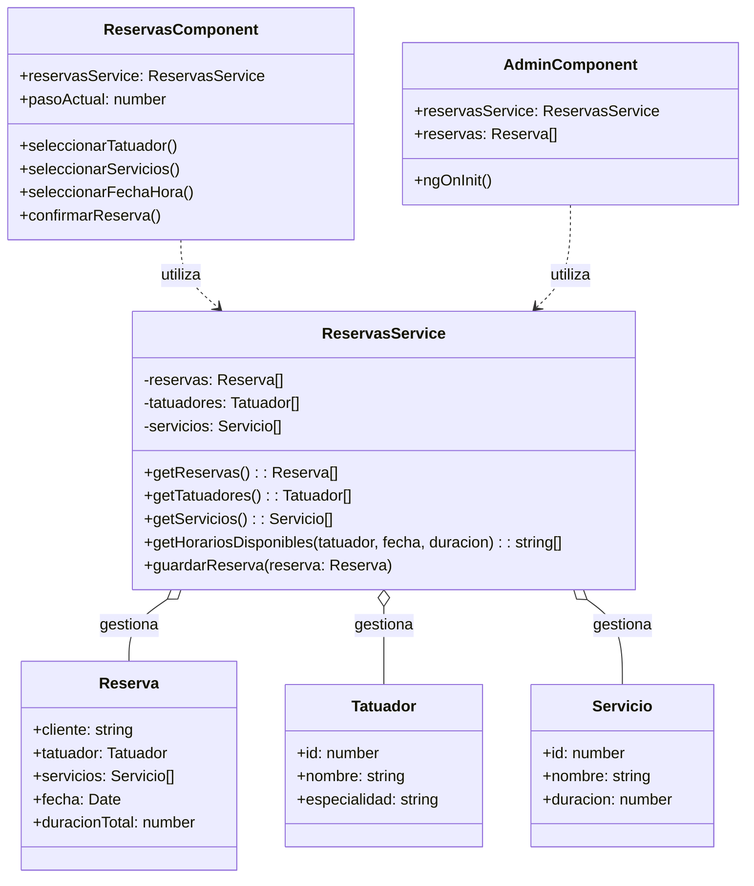
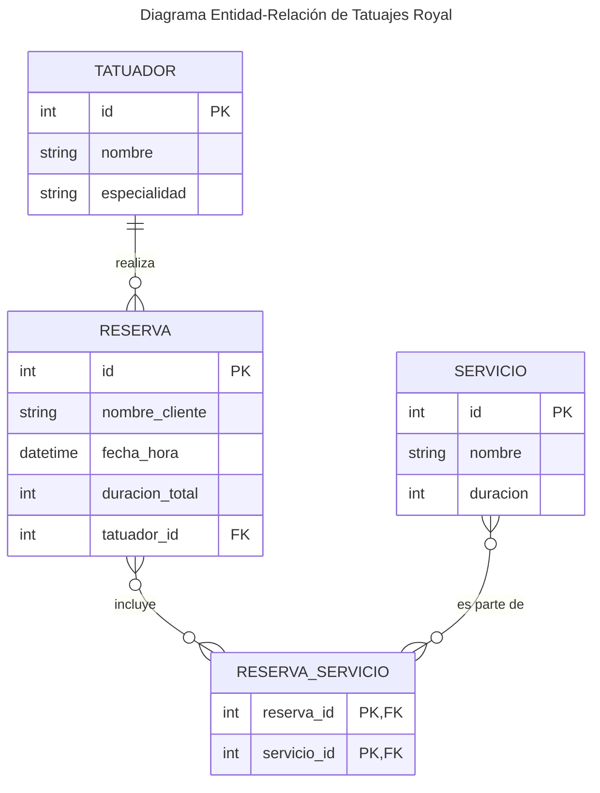
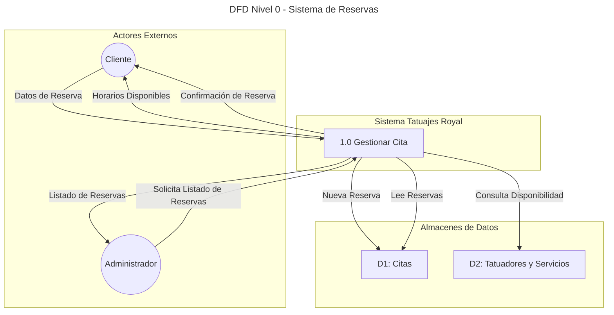

# TatuajesApp Royal - Sistema de Gestión de Turnos

## 1. Introducción

**Tatuajes Royal** es una aplicación web SPA (_Single Page Application_) desarrollada como proyecto final para la materia **Algoritmos y Estructura de Datos III** de la carrera de Analista de Sistemas. El objetivo principal es aplicar conceptos avanzados de desarrollo de software, arquitectura y lógica algorítmica en un caso práctico y funcional: un sistema de gestión de reservas para un estudio de tatuajes.

La aplicación permite a los clientes reservar turnos de manera online a través de un flujo interactivo y guiado, mientras que provee a los administradores una vista para gestionar y consultar todas las reservas agendadas.

---

## 2. Objetivos del Proyecto

### 2.1. Objetivo General

Desarrollar una aplicación web robusta y escalable que solucione la necesidad de digitalizar y automatizar el proceso de agendamiento de citas en un estudio de tatuajes, mejorando la experiencia del cliente y la eficiencia operativa del negocio.

### 2.2. Objetivos Específicos

- **Implementar un flujo de reserva multi-paso** para guiar al usuario de forma intuitiva.
- **Gestionar la disponibilidad de los tatuadores** en tiempo real, evitando conflictos de horarios.
- **Calcular dinámicamente la duración total y el costo** de los turnos en función de los servicios seleccionados.
- **Proveer un panel de administración** para la visualización centralizada de todas las reservas.
- **Construir una interfaz de usuario moderna** y responsive utilizando las mejores prácticas de diseño.

---

## 3. Arquitectura y Tecnologías

La aplicación se construyó sobre el ecosistema de **Angular**, aprovechando su arquitectura basada en componentes y su robusto sistema de inyección de dependencias.

### 3.1. Stack Tecnológico

- **Framework Frontend**: Angular 17+.
- **Lenguaje**: TypeScript 5+.
- **Estilos**: SCSS, Tailwind CSS y Angular Material para componentes UI.
- **Gestión de Estado**: Servicios de Angular con patrón Singleton, gestionando el estado de las reservas en memoria (simulando una base de datos).
- **Entorno de Desarrollo**: Node.js y Angular CLI.

### 3.2. Diseño Arquitectónico

- **Componentes Standalone**: Se utiliza la arquitectura de componentes _standalone_ (introducida en Angular 15 y consolidada en versiones posteriores), lo que elimina la necesidad de `NgModules` y promueve una mayor modularidad y un acoplamiento más bajo.
- **Estructura de Carpetas**: El proyecto se organiza en `pages` (componentes de ruta principal) y `components` (componentes reutilizables como el header o footer).
- **Servicios y Lógica de Negocio**: La lógica de negocio está centralizada en servicios inyectables. El más importante es `ReservasService`, que actúa como _"fuente de la verdad"_ para todo lo relacionado con tatuadores, servicios y reservas. Este servicio es un Singleton, garantizando una única instancia a lo largo de la aplicación.
- **Enrutamiento**: Se utiliza el enrutador de Angular para definir las distintas páginas de la aplicación, con animaciones de transición entre rutas para mejorar la experiencia de usuario.

---

## 4. Funcionalidades Implementadas

### 4.1. Flujo de Reserva de Turnos

El corazón de la aplicación es su sistema de reservas, implementado como un asistente de 4 pasos:

1.  **Selección de Tatuador/a**: El usuario elige con qué artista desea atenderse.
2.  **Selección de Servicios**: El usuario puede seleccionar uno o más diseños o servicios. La duración total de la cita se calcula automáticamente.
3.  **Selección de Fecha y Hora**: Se presenta un calendario donde el usuario elige un día. A continuación, el sistema ejecuta el algoritmo de disponibilidad y muestra únicamente los horarios libres para el tatuador/a y la duración total requerida.
4.  **Confirmación**: El usuario revisa un resumen de su cita (tatuador/a, servicios, fecha, hora, duración) e ingresa su nombre para confirmar. La reserva se guarda en `ReservasService`.

### 4.2. Panel de Administración

- **Acceso**: A través de la ruta `/admin` (accesible desde un enlace en el pie de página).
- **Funcionalidad**: Muestra una tabla con todas las reservas realizadas en el sistema. Cada fila detalla:
    - Nombre del cliente.
    - Tatuador/a asignado.
    - Lista de servicios solicitados.
    - Fecha y hora exactas de la cita.
    - Duración total en minutos.

---

## 5. Lógica Clave: Algoritmo de Disponibilidad

El componente más complejo a nivel algorítmico es el método `getHorariosDisponibles` dentro de `ReservasService`. Este se encarga de calcular qué horarios están libres para un/a tatuador/a en una fecha específica, considerando la duración total de los servicios que el cliente desea reservar.

### 5.1. Parámetros de Entrada

- `tatuador`: El objeto del tatuador/a seleccionado.
- `fecha`: El día seleccionado por el cliente.
- `duracionTotal`: La suma en minutos de la duración de todos los servicios seleccionados.

### 5.2. Proceso del Algoritmo

1.  **Generación de Intervalos Potenciales**: El algoritmo define primero el horario laboral (ej: de 9:00 a 19:00) y genera una lista de todos los posibles horarios de inicio de turno en intervalos fijos (ej: cada 30 minutos).

2.  **Recuperación de Reservas Existentes**: Se filtran todas las reservas guardadas para obtener únicamente las que corresponden al tatuador/a y la fecha seleccionados.

3.  **Verificación de Superposición (Colisión)**: Por cada horario potencial de la lista, el algoritmo realiza una comprobación de colisión contra todas las reservas existentes. 
    - Un **horario potencial** se define por su `horaInicioPotencial` y su `horaFinPotencial` (`horaInicioPotencial + duracionTotal`).
    - Una **reserva existente** se define por su `horaInicioExistente` y su `horaFinExistente` (`horaInicioExistente + duracionReserva`).

    La condición matemática para detectar una superposición entre dos intervalos de tiempo `[A, B]` y `[C, D]` es: `(A < D) y (C < B)`.

4.  **Filtrado y Resultado**: Si un horario potencial no se superpone con *ninguna* de las reservas existentes, se considera un horario disponible y se añade a la lista de resultados que se devolverá a la interfaz de usuario.

Este enfoque garantiza que no se puedan agendar turnos superpuestos y que la disponibilidad mostrada al cliente sea siempre precisa.

---

---

## 6. Diagramas del Sistema

### 6.1. Diagrama de Clases

Este diagrama muestra las principales clases y servicios del sistema y cómo interactúan entre sí. Se centra en los componentes responsables de la lógica de negocio.

### 6.2. Diagrama de Entidad-Relación (DER)

El DER modela las entidades de datos principales y sus relaciones. Dado que no hay una entidad "Cliente" formal, el nombre del cliente se almacena como un atributo en la reserva.

### 6.3. Diagrama de Flujo de Datos (DFD) - Nivel 0

Este DFD ilustra el flujo de información entre los actores externos (Cliente, Administrador) y el sistema.

### 6.4. Análisis de Riesgos

Se identificaron los siguientes riesgos potenciales durante el ciclo de vida del proyecto.

| Riesgo                               | Probabilidad | Impacto | Estrategia de Mitigación                                                                                                |
| ------------------------------------ | :----------: | :-----: | ----------------------------------------------------------------------------------------------------------------------- |
| **Técnico:** Pérdida de datos        |      🟢      |   🔴    | Implementar persistencia en una base de datos real (ej. Firebase, MongoDB) y realizar backups periódicos.                 |
| **Técnico:** Conflicto de reservas   |      🟢      |   🟡    | El algoritmo de disponibilidad está diseñado para evitarlo. Realizar pruebas de estrés y concurrencia.                 |
| **Operativo:** Interfaz poco intuitiva |      🟡      |   🟡    | Realizar pruebas de usabilidad (UX) con usuarios finales y refinar el flujo de reserva basándose en el feedback.        |
| **Proyecto:** Requisitos cambiantes    |      🟡      |   🟡    | Mantener una comunicación fluida con el stakeholder (dueño del estudio) y utilizar metodologías ágiles para adaptarse. |
| **Seguridad:** Acceso no autorizado    |      🔴      |   🔴    | Implementar un sistema de autenticación y autorización para proteger el panel de administración (`/admin`).            |

**Leyenda:**
- **Probabilidad / Impacto:** 🟢 Bajo / 🟡 Medio / 🔴 Alto

## 7. Cómo Ejecutar el Proyecto

1.  Clonar el repositorio.
2.  Instalar las dependencias con `npm install`.
3.  Ejecutar el servidor de desarrollo con `ng serve`.
4.  Abrir el navegador en `http://localhost:4200`.

## 8. Despliegue

Para generar una versión de producción, ejecutar el comando `ng build`. Esto creará la carpeta `dist/tatuajes-app`, cuyo contenido está optimizado y listo para ser desplegado en cualquier servicio de hosting de sitios estáticos como Netlify, Vercel o GitHub Pages.

